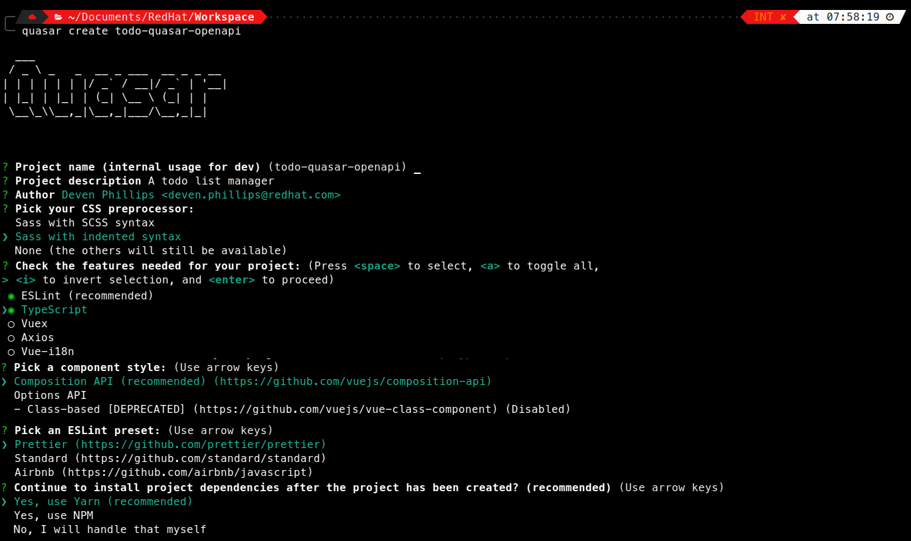

= Accelerating Application Design With OpenAPI
:source-highlighter: rouge
:rouge-style: magritte
:icons: font

## Getting The Tools

Before you begin, you will need to ensure that your development environment is properly configured. To make that happen you will want certain tools installed and usable. Most of this tutorial will assume a UNIX-like environment (MacOS, Linux, WSL2).

* Install http://www.nodejs.org/[NodeJS]
* Install a https://adoptopenjdk.net/[Java Virtual Machine] >= 11 (Prefer 17)
* Install https://www.npmjs.com/package/yarn[Yarn]

## Bootstrap Your Project

* Install Quasar CLI
** `yarn global add @quasar/cli@latest`

<<<

* Create your new project. We will be creating a household bills manager and cash flow analyzer
** `quasar create todo-quasar-openapi`

[cols="2*"]
|===
a|

a|
Choose:

* Sass with indented syntax
* ESLint & Typescript
* Composition API
* Prettier
* Yes, use Yarn
|===

* Change to the new project directory
** `cd todo-quasar-openapi`
* Add Dev dependencies
** `yarn add -D rimraf @openapitools/openapi-generator-cli @stoplight/prism-cli npm-watch`
* Create a basic OpenAPI contract
** In the root of your new project, add the following to `openapi.yml`

[source,yaml]
----
openapi: 3.0.2
info:
  title: Todo
  version: 1.0.0
  description: My Application
servers:
  - url: "http://{domain}:{port}{base_path}"
    description: "API URL"
    variables:
      base_path:
        enum:
          - /
          - /api/v1
        default: /
      domain:
        enum:
          - localhost
        default: localhost
      port:
        enum:
          - '7080'
        default: '7080'
tags:
  - name: api
paths:
  /health:
    get:
      operationId: getHealth
      responses:
        '200':
          description: 'OK'
          content:
            application/json:
              schema:
                $ref: '#/components/schemas/Errors'
        default:
          $ref: '#/components/responses/Error'
components:
  responses:
    Error:
      description: Error
      content:
        application/json:
          schema:
            $ref: '#/components/schemas/Errors'
  schemas:
    Errors:
      type: object
      required:
        - code
      properties:
        timestamp:
          type: string
          format: date-time
        msg:
          type: string
        code:
          type: number
          format: int64
----

TIP: This is a reasonable start for any new REST API contract

<<<

* Add new items to the `scripts` block in `package.json`

[source,json]
----
"dev": "quasar dev",
"watch": "npm-watch",
"prism": "prism mock -d --cors -p 7080 openapi.yml",
"openapi": "rimraf src/sdk; mkdir src/sdk; openapi-generator-cli generate -g typescript-axios -i openapi.yml -o src/sdk/ -p withSeparateModelsAndApi=true,apiPackage=api,modelPackage=models"
----

//

* Add `watch` block to `package.json` after the `scripts` block

[source,json]
----
"watch": {
  "openapi": {
    "patterns": [     <1>
      "openapi.yml",
      "package.json"
    ],
    "inherit": true
  },
  "prism": true,      <2>
  "dev": {
    "patterns": [     <3>
      "yarn.lock",
      "package.json",
      "src/main.ts",
      "src/quasar-user-options.ts",
      "tsconfig.json",
      "vue.config.js",
      "babel.config.js"
    ],
    "inherit": true
  }
},
----
<1> When either `openapi.yml` or `package.json` change, https://openapi-generator.tech/docs/generators/typescript-axios[regenerate the OpenAPI Client] code
<2> Ensure that the `prism` https://github.com/stoplightio/prism[mock API server] is running. It will automatically detect changes in the OpenAPI file.
<3> When any of the core framework files change, restart the development web server

<<<

[IMPORTANT]
What did I just accomplish?
====
You have just created a new project using the https://quasar.dev/[Quasar] framework for https://v3.vuejs.org/[VueJS]. You also added tooling which will allow you to both create a Mock API server (using Prism) but also generate the code which allows you to talk to that API automatically. As we proceed, you will see that when we need a new data type or new API method, we can quickly add it to the `openapi.yml` file and the `npm-watch` tool will automatically regenerate the necessary code and restart the necessary services.
====

<<<

## Open your project in your preferred IDE

These are IDE's I have had good luck with

* https://code.visualstudio.com/[VSCode]
* https://www.jetbrains.com/webstorm/[WebStorm]

## Clean Up Some Boilerplate

* Delete the files:
** `src/components/CompositionComponent.vue`
** `src/components/EssentialLink.vue`
** `src/components/models.ts`
* Replace the contents of `src/pages/Index.vue`

[source]
----
<template>
  <q-page class="row items-center justify-evenly"> </q-page>
</template>

----

<<<

* Replace the contents of `src/layouts/MainLayout.vue`

[source]
----
<template>
  <q-layout view="lHh Lpr lFf">
    <q-header elevated>
      <q-toolbar>
        <q-btn flat dense round icon="menu" aria-label="Menu" @click="toggleLeftDrawer" />
        <q-toolbar-title> Quasar App </q-toolbar-title>
        
Quasar v{{ $q.version }}

      </q-toolbar>
    </q-header>
    <q-drawer v-model="leftDrawerOpen" show-if-above bordered>
      <q-list> </q-list>
    </q-drawer>
    <q-page-container>
      <router-view />
    </q-page-container>
  </q-layout>
</template>

----

<<<

## Start Building Todo User Interface

* We know that we're going to need a Todo object type, so let's create that in the `openapi.yml`

[source,yaml]
----
components:
  schemas:
    NewTodo:
      type: object
      required:
      - title
      properties:
        title:
          type: string
          maxLength: 255
        description:
          type: string
        id:
          type: string
          format: uuid
----

//

* That will be a good object definition for when we are creating a new Todo item, but we also want some validation, so let's create a `Todo` type which has some required fields:

[source,yaml]
----
components:
  schemas:
    Todo:
      type: object
      required:
      - title
      - id
      allOf:
      - $ref: '#/components/schemas/NewTodo'
----

<<<

* Let's add a new endpoint to let us get the complete list of Todos

[source,yaml]
----
tags:
  - name: api
  - name: todo    # <1>
paths:
  /todos:
    get:
      description: Get all todos
      operationId: getAllTodos    # <2>
      tags:
        - todo
      responses:
        '200':
          description: 'OK'
          content:
            application/json:
              schema:
                type: array
                items:
                  $ref: '#/components/schemas/Todo'
----
<1> The tag becomes the name of the API object for this tag
<2> The `operationId` becomes the method name in the API object to call in order to access that endpoint

//

* Once we add these, save the file and start our `watch` script 

[source,bash]
----
$ yarn watch
SNIP...

DONE  Compiled successfully in 5779ms
----

[NOTE]
What is happening here?
====
By defining the `NewTodo` and `Todo` schemas along with the `/todo` **GET** operation in the `openapi.yml` file and starting the watch, prism and openapi-generator start up the mock API server and generate the client-side code for talking to the API. The API client code can be found in `src/sdk` and we will use it to talk to the mock API as we develop the user interface application.
====

## Create State Management For The Application With Pinia

https://pinia.esm.dev/[Pinia] is a state management extension for VueJS and it offers a way of reducing thrashing and complexity by allowing you to centrally manage the state information in your web application. In this application, we will use it to make integration with our API simpler and more efficient.

//

* Create the subdirectory `src/stores` and create a new file there called `APIPlugin.ts`
** This file will become an extension plugin for Pinia which allows us to manage API calls centrally

//

* In `APIPlugin.ts` we're going to embed our API client(s) into the state management system by extending the pinia context:

[source,typescript]
----
import { Configuration } from './../sdk/configuration';
import { PiniaPluginContext } from "pinia";

declare module 'pinia' {

    export interface PiniaCustomProperties<Id, S, G, A> {
        id: Id            // <1>
        state?: () => S
        getters?: G
        actions?: A
    }
    
    export interface DefineStoreOptionsInPlugin<Id extends string, S extends StateTree, G, A> extends Omit<DefineStoreOptions<Id, S, G, A>, 'id' | 'actions'> {
        apiConfig: Configuration  // <2>
    }
}
----
<1> These are the default properties inside of a Pinia context
<2> We are extending the options for Pinia to allow it to store our API configuration object, the code for which was generated by `openapi-generator` via our `watch`

<<<

* Add the `TodoApi` to the Pinia custom properties

[source,typescript]
----
import { Configuration, TodoApi } from "@/sdk";
import { PiniaPluginContext } from "pinia";

declare module 'pinia' {
    
    export interface PiniaCustomProperties<Id, S, G, A> {
        id: Id
        state?: () => S
        getters?: G
        actions?: A
        todoApi: TodoApi    // <1>
    }

    export interface DefineStoreOptionsInPlugin<Id extends string, S extends StateTree, G, A> extends Omit<DefineStoreOptions<Id, S, G, A>, 'id' | 'actions'> {
        apiConfig: Configuration
    }
}

export const APIPlugin = ({options, store}: PiniaPluginContext): void => { // <2>
    const { apiConfig } = options;

    if (apiConfig) {
        store.todoApi = new TodoApi(apiConfig)
    } else {
        store.todoApi = new TodoApi()
    }
}
----
<1> Add the new field definition so that we can attach the API object to the state properties
<2> Override the Pinia context so that it initializes 
the API client on load

//

* Initialize Pinia by creating a Quasar boot file:
** `quasar new boot pinia -f ts`
** Edit `src/boot/pinia.ts` to match the code below:

[source#src/boot/pinia.ts,typescript]
----
import { boot } from 'quasar/wrappers';
import { createPinia } from 'pinia';
import { APIPlugin } from 'src/stores/APIPlugin';

export default boot(({ app }) => {
  const pinia = createPinia();
  pinia.use((context) => APIPlugin(context));
  app.use(pinia);
});
----

** Enable the `pinia` boot file in `<root>/quasar.conf.js`

[source,javascript,highlight=21..23]
----
const { configure } = require('quasar/wrappers');

module.exports = configure(function (ctx) {
  return {
    // https://quasar.dev/quasar-cli/supporting-ts
    supportTS: {
      tsCheckerConfig: {
        eslint: {
          enabled: true,
          files: './src/**/*.{ts,tsx,js,jsx,vue}',
        },
      },
    },

    // https://quasar.dev/quasar-cli/prefetch-feature
    // preFetch: true,

    // app boot file (/src/boot)
    // --> boot files are part of "main.js"
    // https://quasar.dev/quasar-cli/boot-files
    boot: [
      'pinia'
    ],
    // .. SNIP ..
  }
}
----

<<<

## Create Our First Pinia Store

* Create a new file `src/stores/TodoStore.ts`

* In that file, define a `State` interface which will define what we keep in this store:

[source,typescript]
----
import { Todo } from '@/sdk';

interface State {
    todos: Todo[]
}
----

<<<

* Now, let's define our Todos store:

[source,typescript]
----
import { Todo } from '@/sdk';
import { defineStore } from 'pinia';

interface State {
  todos: Todo[]
}

export const initState = (): State => ({  // <1>
  todos: [],
});

export const todoStore = defineStore('todos', {
  state: initState,

  getters: {
    todoList: (state) => state?.todos     // <2>
  },

  actions: {
    async loadTodos() {                   // <3>
      try {
        const { data } = await this.todoApi.getAllTodos();
        this.updateTodos(data);
      } catch (err) {
        // Do something with the error?
      }
    },
    updateTodos(todos: Todo[]) {          // <4>
      this.todos = todos;
    }
  }
});
----
<1> Initialize the State object with it's default values (an empty array)
<2> Create a getter which we can use in our components to retrieve data from the store
<3> Create an action which uses our API client code to load Todos from the REST service
<4> Create another method which applies the todos to the state once our Async method completes

// 

// 

* Now, let's use that newly created store in our `Index.vue` view

<<<

## Use Our First API Call

* Open the `src/pages/Index.vue` file and set the template as follows:

[source]
----
<template>
  <q-page class="flex q-pa-md">
    

      

        Title/Description
        <q-btn @click="todos.loadTodos" flat dense icon="refresh" />
      

      

        Done?
      

    

    

      

        <q-expansion-item :label="todo.title">
          {{ todo.description }}
        </q-expansion-item>
      

      

        <q-checkbox :model-value="todo.complete" />
      

    

  </q-page>
</template>
----

* Add the following code to the `<script>` block

[source,typescript]
----
import { todoStore } from '../stores/TodoStore';
import { computed, onBeforeMount } from 'vue';
const todos = todoStore();

const todoList = computed(() => todos.todoList);

onBeforeMount(async () => {
  await todos.loadTodos();
});
----
<1> Instantiate our Pinia store
<2> Load the Todo items from the API service
<3> Map the `todoList` from the store to a computed/reactive property

<<<

* We also need to add some items to the `
----

//

* Now, you should see the page reload and a table of Todo items! That's fantastic, but what if our API is accessed over a slow link or our servers are overloaded? How can we add a loading indicator?

<<<

## Using A Loading Indicator

* First, let's add one of the Quasar `QAjaxBar` elements to our template in the `Home.vue` file. It can be places anywhere in the template.

[source,html]
----
    <q-ajax-bar
      ref="progressBar"
      position="bottom"
      color="red-8"
      size="0.75rem"
      skip-hijack
    />
----

NOTE: The `ref` attribute allows us to use the `ref()` method to get a reference to this component in the script block

* In the script block, get a reference to the `QAjaxBar` and create some anonymous functions from it

[source,typescript]
----
export default defineComponent(() => {
  const progressBar = ref<QAjaxBar>();
  const incrementer = (increment?: number) => progressBar?.value?.increment(increment);
  const stop = () => progressBar?.value?.stop();
----

* Create a wrapper around our `loadTodos` method from the `TodoStore`

[source,typescript]
----
  function loadTodos() {
    progressBar?.value?.start();
    todos.loadTodos(increment, stop);
  }

  loadTodos();
----

<<<

* Open up our `TodoStore.ts` store definition and modify the `loadTodos` action method:

[source,typescript]
----
async loadTodos(increment: (increment?: number) => void, stop: () => void) {
    increment(10);                                  // <1>
    const axiosConfig = {
        onUploadProgress: (progressEvent: ProgressEvent) => {
            increment(progressEvent.loaded * 80);   // <2>
        }
    }
    increment(20);                                  // <3>
    try {
        const { data } = await this.todoApi.getAllTodos(axiosConfig);
        this.updateTodos(data);
        stop();                                     // <4>
    } catch (err) {
        // Do something with the error?
    }
    increment(100);                                 // <5>
},
----
<1> Kick off the Ajax bar by setting it to 10 percent
<2> Set the `onUploadProgress` callback to increment the Ajax bar whenever there are updates. We multiply the `loaded` value (between 0.0 and 1.0) by 80
<3> Bump up to 20 percent complete
<4> Signal the Ajax bar that the operation is complete
<5> If the Ajax bar is not already 100 percent, put it there now

[TIP]
.How Does This Work?
====
The `ref` to progressBar gives us access to the `start`, `stop`, and `increment` methods of `QAjaxBar` and we are passing the
`increment` and `stop` methods to our `loadTodos` method in the store. The store action can then manipulate the state of the `QAjaxBar`
based on callbacks from the https://axios-http.com/[Axios] REST client.
====

<<<

## Error Handling

Inside of our store, we need to handle potential errors when making calls to the REST API. Quasar has us covered with it's **Notify** plugin

* Open `src/quasar-user-options.ts` and add the `Notify` plugin

[source,typescript]
----
import './styles/quasar.sass'
import '@quasar/extras/material-icons-round/material-icons-round.css'
import '@quasar/extras/mdi-v4/mdi-v4.css'
import '@quasar/extras/material-icons/material-icons.css'

// To be used on app.use(Quasar, { ... })
export default {
  config: {},
  plugins: {
    'Notify'
  }
}
----

* Open `src/stores/TodoStore.ts` and we can add notifications to our action method:

[source,typescript]
----
async loadTodos(
                notify: (message: string, type: string) => void,
                increment: (increment?: number) => void,
                stop: () => void
                ) {
    increment(10);
    const axiosConfig = {
        onUploadProgress: (progressEvent: ProgressEvent) => {
            increment(progressEvent.loaded * 80);
        }
    }
    increment(20);
    try {
        const { data } = await this.todoApi.getAllTodos(axiosConfig);
        this.updateTodos(data);
        stop();
    } catch (err) {
        notify('An error occurred loading Todo items from the API', 'negative');
    }
    increment(100);
},
----

<<<

* Then we need to add the changes to `Home.vue`

[source,typescript]
----
import { todoStore } from "@/stores/TodoStore"
import { QAjaxBar, useQuasar } from 'quasar';         // <1>
import { computed, defineComponent, ref } from "vue";

export default defineComponent(() => {
  const todos = todoStore();
  const progressBar = ref<QAjaxBar>();
  const increment = (increment?: number) => progressBar?.value?.increment(increment);
  const stop = () => progressBar?.value?.stop();
  const $q = useQuasar();                             // <2>
  const notify = (message: string, type = 'info') => $q.notify({ message, type });  // <3>

  function loadTodos() {
    progressBar?.value?.start();
    todos.loadTodos(notify, increment, stop);         // <4>
  }
----
<1> Import the `useQuasar` function
<2> Instantiate the `$q` Quasar helper object
<3> Create an anonymous function for notifications we can pass to our store
<4> Update the call to `loadTodos`, passing in the notify function

[NOTE]
====
If we stop our `yarn watch` and instead just launch the Vue application with `yarn serve`, we can reload the page and see an error when the API call fails

image::REST_API_Error_Notify.png[]

====

<<<

## And Now The Fun Begins

So far, I have shown you some nice features of being able to have a Mock API and using Quasar Framework to build a UI. Now, we combine
those 2 capbilities in order to really accellerate our ability to deliver business value. Let us imagine that we show our simple Todo
application to our business stakeholder and they respond "But that's missing the features I need like a due date and a completion
indicator!". In a traditional application development environment, you would have to run to tell the backend developers to make changes
while the UI is updated as well. Since we have not yet involved any backend developers, we do not really care. We just make a quick
change to our API contract and use those new fields in our UI! We continue iterating with feedback from our stakeholders until we
achieve the user experience they desire. Only **AFTER** we have the user experience defined and validated do we then use the
API contract to generate most of the backend and therefore we save time and rework. In other words, we deliver busines value more
efficiently.

* Start by adding the new fields to the API contract

[source,yaml]
----
components:
  schemas:
    NewTodo:
      type: object
      required:
      - title
      properties:
        title:
          type: string
          maxLength: 255
        description:
          type: string
        id:
          type: string
          format: uuid
        due_date:             # <1>
          type: string
          format: date-time
          nullable: true
        completed:            # <2>
          type: string
          format: date-time
          nullable: true
----
<1> The new `due_date` field which is nullable
<2> The new `completed` field which is nullable

<<<

* Add some markup to our template inside of `Home.vue`

[source,html]
----

  

  

    Title/Description
    <q-btn icon="refresh" dense flat @click="reload" />
  

  
Due

  

    <q-icon name="check" color="positive" size="md"/>
  

<q-scroll-area style="height: 82vh; width: 100vw;">
  <q-list>
    <q-item v-for="todo in todoList" :key="todo.id" class="row datatable">
      <q-item-section class="small-cell" dense>
        <q-btn icon="edit" size="0.8rem" flat dense />
      </q-item-section>
      <q-item-section class="col-grow">
        <q-expansion-item :label="todo.title">
        <template v-slot:header>
          {{ todo.title }}
        </template>
        <template v-slot:default>
          {{ todo.description }}
        </template>
        </q-expansion-item>
      </q-item-section>
      <q-item-section class="col-2">
        {{ dateFormat(todo.due_date) }}
      </q-item-section>
      <q-item-section class="small-cell">
        <q-checkbox :model-value="isComplete(todo.completed)" dense flat />
      </q-item-section>
    </q-item>
  </q-list>
</q-scroll-area>
----

IMPORTANT: **SUCCESS** - You are immediately able to see the new information in your development webapp! While live reloading is not that uncommon, remember that we are accessing and loading that data **from a REST API server** already. Once we iteratively refine this UI and user experience, we can hand off the OpenAPI contract to the backend developers for a very efficient implementation which will have **little or no integration issues!**